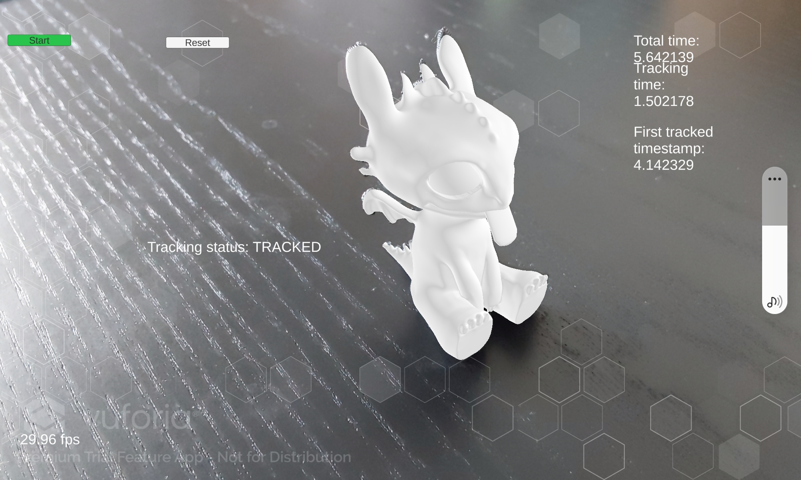

# ARKit Application
This application uses Apple's ARKit for 3D object detection in augmented reality.

## Features

- 3D object detection using ARKit's ARObjectScanningConfiguration.

## Requirements

- iOS device
- Xcode 
- ARKit

## Installation

1. Install the ARScanning application from [Apple's Developer Documentation](https://developer.apple.com/documentation/arkit/arkit_in_ios/content_anchors/scanning_and_detecting_3d_objects). This application is necessary to scan your target objects and prepare them for detection in ARKit.
2. Clone the arkit_detection file
3. Open it with xcode and add your .arobject into the ressources folder

## Usage

1. Scan your target object in the real-world environment where it will be detected. It is important to scan the object in the same environment, as variations in lighting and surroundings can affect the detection accuracy.
2. Load the resulting ARObject file into the Resources folder of the ARKit app in Xcode. The name of the scan will be displayed in the detection phase.
3. After loading your scans into the ARKit app, you can run the app on your device to begin detecting your objects.

Please note that the initial setup requires the installation of the ARScanning app to prepare your target objects for detection.

---

# Vuforia Engine and Unity Application

This application leverages the Vuforia Engine integrated with Unity to create immersive AR experiences. It uses the Model Target feature of Vuforia for 3D object detection.

## Features

- 3D model-based object detection using Vuforia's Model Target feature.

## Requirements

- Unity version requirement
- Vuforia Engine version requirement (Set up instructions: [Vuforia Engine in Unity](https://library.vuforia.com/getting-started/getting-started-vuforia-engine-unity))
- Model Target Generator ([User Guide](https://library.vuforia.com/objects/model-target-generator-user-guide))

## Installation

1. Clone this repository.
2. Open Unity and navigate to the repository location.
3. Follow the setup instructions to integrate the Vuforia Engine with your Unity project.

## Usage

1. Use the Model Target Generator to create your model target and export it to Unity.
2. In Unity, add the provided controller script to the model target.
3. According to the script, add several buttons and textfields as shown in the image below.
   
   
   
4. Set the build settings in Unity:
    - Target platform: Android
    - Minimum API level: 28
    - Scripting backend: IL2CPP
    - API compatibility level: .NET Standard
    - Architecture: ARM64
5. Connect your Android device, select it as the build destination, then click 'Build and Run' to install the application on your device.

---

## License

MIT

